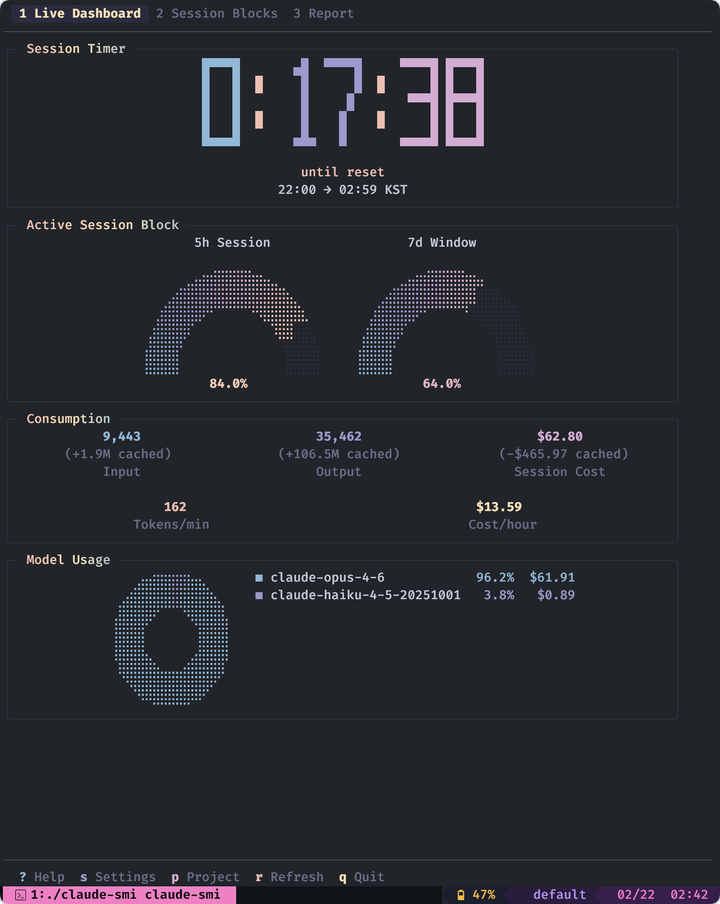
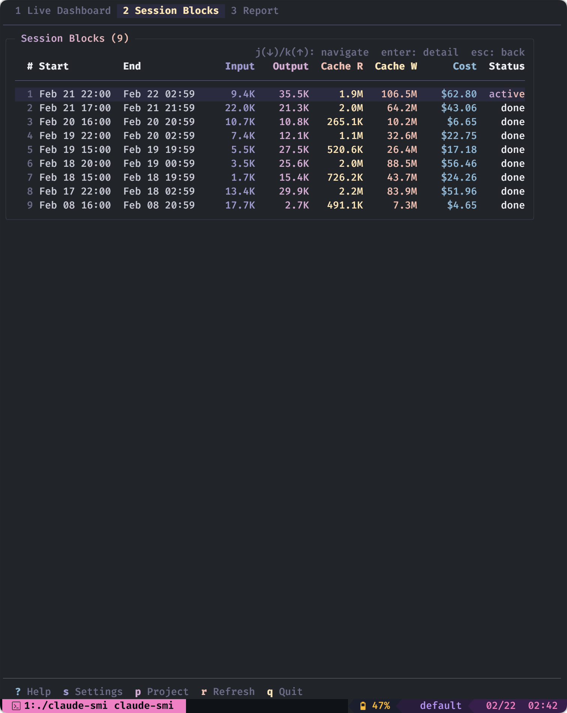
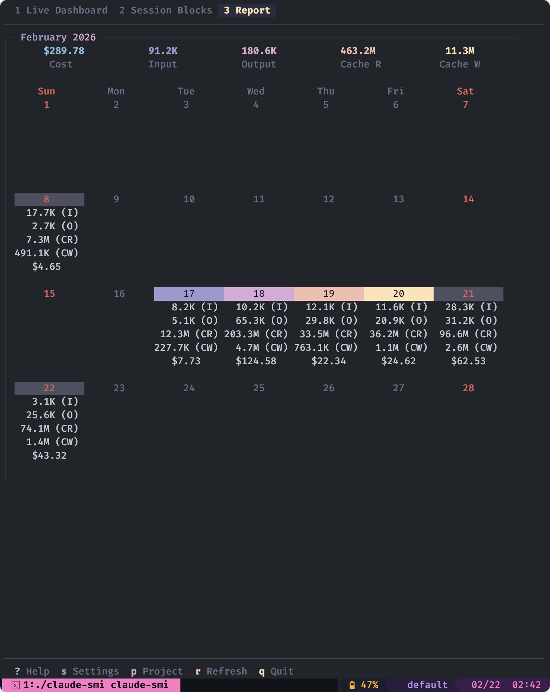

# claude-smi

Terminal UI for monitoring Claude Code token usage and costs — built for **Max/Team/Enterprise subscribers** who want visibility into their consumption against plan limits. Inspired by `nvidia-smi`.



## Features

- **Live Dashboard** — active session timer, token/cost gauges, burn rate, model breakdown pie chart
- **Session Blocks** — per-session history with input, output, cache, and cost columns
- **Daily Report** — calendar heatmap with daily aggregated usage



- **Dynamic Pricing** — fetches current model prices from LiteLLM on startup
- **Project Filter** — multi-select filter to view usage by project

## Install

### Download binary

Prebuilt binaries for macOS, Linux, Windows (amd64/arm64):

https://github.com/anomredux/claude-smi/releases/latest

```bash
VERSION=0.1.0

# macOS (Apple Silicon)
curl -sL https://github.com/anomredux/claude-smi/releases/download/v${VERSION}/claude-smi_${VERSION}_darwin_arm64.tar.gz | tar xz
sudo mv claude-smi /usr/local/bin/

# macOS (Intel)
curl -sL https://github.com/anomredux/claude-smi/releases/download/v${VERSION}/claude-smi_${VERSION}_darwin_amd64.tar.gz | tar xz
sudo mv claude-smi /usr/local/bin/

# Linux (amd64)
curl -sL https://github.com/anomredux/claude-smi/releases/download/v${VERSION}/claude-smi_${VERSION}_linux_amd64.tar.gz | tar xz
sudo mv claude-smi /usr/local/bin/
```

### go install

```bash
go install github.com/anomredux/claude-smi/cmd/claude-smi@latest
```

### Build from source

```bash
git clone https://github.com/anomredux/claude-smi.git
cd claude-smi
go build -o claude-smi ./cmd/claude-smi
```

## Prerequisites

claude-smi reads Claude Code's JSONL logs from `~/.claude/projects/` and fetches live session data using the OAuth token stored in your system's credential store.

| OS | Credential Store | Setup |
|---|---|---|
| macOS | Keychain | None |
| Linux | libsecret | `sudo apt install libsecret-tools` |
| Windows | Credential Manager | None |

## Usage

```bash
claude-smi                                    # launch TUI
claude-smi --timezone Asia/Seoul              # override timezone
claude-smi --since 2025-01-01 --until 2025-01-31  # date range filter
claude-smi --no-tui --view daily              # JSON output
```

## Keyboard Shortcuts

| Key | Action |
|---|---|
| `1` `2` `3` | Switch view |
| `Tab` / `Shift+Tab` | Cycle views |
| `j` / `k` | Navigate list |
| `h` / `l` | Change month (Report) |
| `Enter` | Drill down |
| `Esc` | Go back |
| `p` | Project filter |
| `s` | Settings |
| `?` | Help |
| `r` | Refresh |
| `q` | Quit |

## Configuration

`~/.config/claude-smi/config.toml`:

```toml
[general]
interval = 10       # refresh seconds
timezone = "UTC"
language = "en"

[notifications]
enabled = true
bell = true
```

## CLI Flags

| Flag | Default | Description |
|---|---|---|
| `--config` | `~/.config/claude-smi/config.toml` | Config file path |
| `--data-dir` | `~/.claude/projects` | Claude Code data directory |
| `--timezone` | config value | Display timezone |
| `--since` | — | Start date (YYYY-MM-DD) |
| `--until` | — | End date (YYYY-MM-DD) |
| `--no-tui` | false | JSON output to stdout |
| `--view` | `daily` | View for --no-tui: `daily`, `blocks` |

## License

MIT
